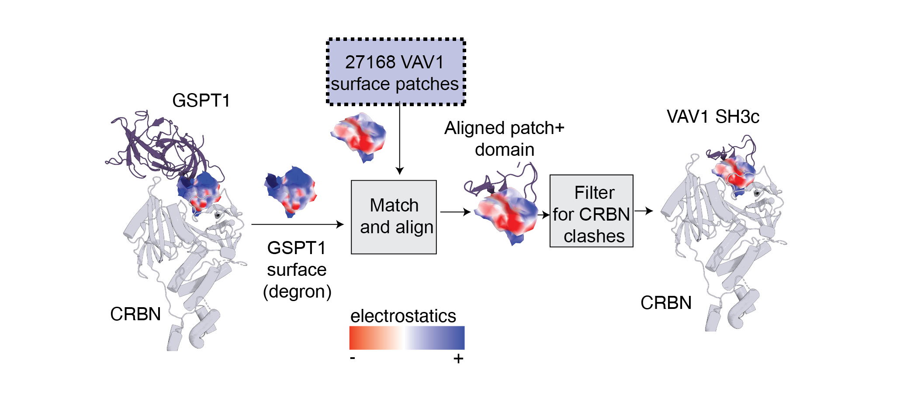

# Surface Matching of the VAV1 degron

This repository contains the code and resources used for the **VAV1 surface matching** section described in the methods of the paper 
"Mining the CRBN Target Space Redefines Rules for Molecular Glue-induced Neosubstrate Recognition". 
The surface matching pipeline leverages code from [MaSIF](http://github.com/LPDI-EPFL/masif) and [MaSIF-seed](http://github.com/LPDI-EPFL/masif_seed/) and implements a method to find similar surface patches between proteins based on geometric deep learning techniques.

## Surface Matching Overview

The **MaSIF-seed** program was originally designed for matching surfaces that exhibit geometric **complementarity**. 
For this work, an algorithm was implemented to match surfaces that display **similarity** or **mimicry**.

### Overall Steps of the Surface Matching Pipeline:

1. **Surface Computation**:
   - Surfaces are computed for each protein structure, and electrostatic/hydropathy/hydrogen bond features for each one are computed (in this case each model of a VAV1 domain).

1. **Surface Decomposition**: 
   - Protein surfaces are decomposed into **overlapping radial patches**. Each vertex on the molecular surface of a protein serves as the center of a patch, with a radius of 12 Å. A system of polar and angluar geodesic coordinates is then computed for each decomposed patch.
   
2. **Fingerprint Generation**: 
   - A **neural network** trained on thousands of proteins from **complementary** surfaces generates a fingerprint for each patch, encoding the chemical and geometric features relevant to binding.

3. **Patch Matching**: 
   - Surface patches from a query protein are compared with those in the dataset. The comparison is based on the **Euclidean distance** between the fingerprint embeddings.
   
4. **Geometric Alignment**: 
   - After fingerprint matching, the **RANSAC algorithm** is used to align matched patches. This step ensures that the structural similarity between the surfaces is geometrically valid.
   
5. **Similarity Scoring**: 
   - A per-vertex similarity score is computed after alignment, using fingerprint distances between matched vertices. This provides a quantitative measure of surface similarity between aligned patches. Since the fingerprints encode both shape and chemical features, the similarity encompasses both. 

### VAV1 Surface Matching

We applied MaSIF-seed to identify **surface similarity** between the VAV1 domain and the degrons of GSPT1 an CK1α in the presence of other proteins in the dataset, including GSPT1 and CK1α. This repository explains how to reproduce the results of the paper.



## Requirements

Masif requires docker and a docker container to run properly. 

## Installation

1. Clone the repository:
    ```bash
    git clone git@github.com:monterosatx/molecular-surface-mining.git
    cd masif_mimicry_paper
    ```

2. Build the docker container.
    ```./build_docker.sh```

3. Run the docker containern and within the container go to the directory where you downloaded the code: 
   ```
   ./run_docker.sh
   cd /path/to/your/repo
   git config --global --add safe.directory $(pwd)
   ```
   

## Usage

All precomputed surface files are provided, so if you wish to run the program directly you can jump to step 3.


1. **Precompute the fingerprints for VAV1**:
    ```
    cd masif/data/masif_vav1_surfaces/
    ./data_prepare_all.sh
    cd ../../../
    ```

2.  **Precompute the fingerprints for the CK1a and GSPT1 degrons.**
   ```
   cd masif_seed_search/data/masif_mimicry_targets
   ./run_target_protocol.sh 5fqd_C # for CK1a
   ./run_target_protocol.sh 6kx9_C # for GSPT1
   ```

3.  **Match CK1a to the GPST1 degrons**
   ```
   cd targets/match_degron_surfaces
   ./run.sh 5fqd_C # for CK1a
   ./run.sh 6xk9_A # for GSPT1
   ```
3.  **To visualize the results**
   ``` 
   cd out_mimicry_run/6xk9_A # For GSPT1 mimicry results
   # find the top scoring results 
   cat $(find . -name "*.score") | sort -k 13 -n
   # The last line of that output should contain the aligned pose whose surface patch had the highest score according to fingeprint similarity (desc_dist_score)
   # To compare it to GSPT1: 
   pymol 
   load 6xk9_A.pdb, CRBN ## Load CRBN, which is in the file called 6xk9_A (this is actually chain C)
   fetch 6xk9_A, GSPT1
   load {path/to/your/top/pose.pdb}
   ```

   The alignments computed for the paper are available in the directory: ```out_mimicry_paper_results```

## PyMOL plugin

A PyMOL plugin to visualize protein surfaces is provided in the source/pymol subdirectory. We used this plugin for all the surface figures 
shown in our paper. This plugin requires PyMOL to be installed in your local computer.

Please see the following tutorial on how to install it:

[Pymol plugin installation](pymol_plugin_installation.md)

To load a protein surface file, run this command inside PyMOL: 

```
loadply ABCD_E.ply
```

   

## Reference

If you use this code, please cite the corresponding publication:

_*Mining the CRBN Target Space Redefines Rules for Molecular Glue-induced Neosubstrate Recognition*_

*Authors:* G. Petzold, P. Gainza, S. Annunziato, I. Lamberto, P. Trenh, L. A. McAllister, B. DeMarco, L. Schwander, R. D. Bunker, M. Zlotosch, R. SriRamaratnam, S. Gilberto, G. Langousis, E. J. Donckele, C. Quan, V. Strande, G. M. De Donatis, S. B. Alabi, J. Alers, M. Matysik, C. Staehly, A. Dubois, A. Osmont, M. Garskovas, D. Lyon, L. Wiedmer, V. Oleinikovas, R. Lieberherr, N. T. Rubin, D. T. Lam, N. I. Widlund, A. Ritzen, R. M. Caceres, D. Vigil, J. Tsai, O. Wallace, M. Peluso, A. Sadok, A. Paterson, V. Zarayskiy, B. Fasching, D. Bonenfant, M. Warmuth, J. Castle, S. A. Townson

_bioRxiv 2024.10.07.616933; doi: https://doi.org/10.1101/2024.10.07.616933_
